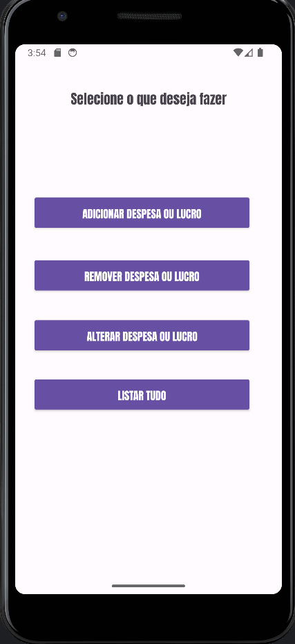
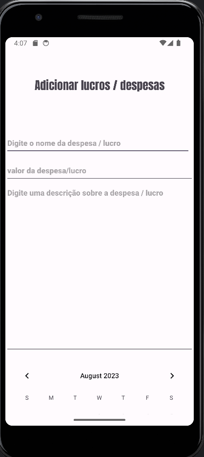
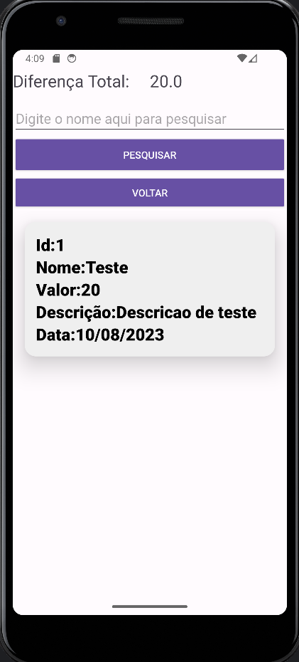

# Despesas/Lucro Mobile
### Descrição do projeto
Esse projeto armazena tanto a despesa como o lucro juntamente com o nome,valor e uma descrição basica sobre a despesa/lucro, tambem é possivel remover uma despesa/lucro, alterar todos os dados apartir do ID e filtrar apartir do nome na pesquisa.

---
### 👩‍💻 Tecnologias

---
### 🖥️ IDE utilizada

---
### Imagens

#### Tela inicial

#### Tela de Adicionar Despesas/Lucros

#### Tela de Listar Despesas/Lucros

